# GLOW Enterprise Database Schema & ER Architecture (MERN Stack)

This document provides the complete **Database Schema**, field-level constraints, indexes, and **Entity-Relationship (ER) Architecture** for the GLOW Campus Transit & Fleet Management System built with **MongoDB** and **Mongoose ODM**.

---

## 1. Visual Entity-Relationship (ER) Diagram

```mermaid
erDiagram
    USER ||--o| STUDENT : "extends (role = student)"
    USER ||--o| DRIVER : "extends (role = driver)"
    USER ||--o{ TRIP : "operates as driver"
    USER ||--o{ TRANSPORTPASS : "owns pass"
    USER ||--o{ FEELEDGER : "has fee ledger"
    USER ||--o{ PAYMENT : "makes payments"
    USER ||--o{ DISCOUNT : "receives discount"
    USER ||--o{ REFUND : "applies refund"
    USER ||--o{ COMPLAINT : "submits complaint"
    USER ||--o{ SOSALERT : "triggers alert"
    USER ||--o{ NOTIFICATION : "receives notification"
    USER ||--o{ AUDITLOG : "performs action"

    STUDENT }o--o| ROUTE : "assigned to corridor"
    DRIVER }o--o| BUS : "assigned shuttle"
    BUS ||--o| USER : "current driver"
    
    TRIP }|--|| BUS : "assigned bus"
    TRIP }|--|| ROUTE : "assigned route"
    
    TRANSPORTPASS }|--|| ROUTE : "valid for corridor"
    MAINTENANCELOG }|--|| BUS : "services vehicle"

    USER {
        ObjectId _id PK
        string name
        string email UK
        string passwordHash
        enum role "student, driver, super_admin, transport_manager, finance_admin"
        string googleId
        string refreshTokenHash
        string avatar
        string phone
        string department
        date createdAt
        date updatedAt
    }

    STUDENT {
        ObjectId _id PK
        ObjectId userId FK "ref User"
        string enrollmentId UK
        string branch
        string semester
        string assignedStopId
        ObjectId routeId FK "ref Route"
        string guardianContact
    }

    DRIVER {
        ObjectId _id PK
        ObjectId userId FK "ref User"
        string licenseNumber
        ObjectId assignedBusId FK "ref Bus"
        string shiftTiming
        number safetyRating
    }

    BUS {
        ObjectId _id PK
        string registrationNumber UK
        number capacity
        number occupancy
        number fuelLevel
        enum status "On Route, Maintenance, Idle, Delayed"
        date fitnessCertExpiry
        ObjectId currentDriverId FK "ref User"
    }

    ROUTE {
        ObjectId _id PK
        string name
        string origin
        string destination
        number distanceKm
        number durationMin
        array stops "embedded stopSchema"
    }

    TRIP {
        ObjectId _id PK
        ObjectId busId FK "ref Bus"
        ObjectId driverId FK "ref User"
        ObjectId routeId FK "ref Route"
        enum status "NOT_STARTED, ON_ROUTE, PAUSED, COMPLETED"
        date startedAt
        date completedAt
        number occupancySnapshot
    }

    TRANSPORTPASS {
        ObjectId _id PK
        ObjectId studentId FK "ref User"
        ObjectId routeId FK "ref Route"
        enum zone "A, B, C"
        enum status "ACTIVE, EXPIRED, PENDING_FEE, BLOCKED"
        date validUntil
        string signedPayload
    }

    FEELEDGER {
        ObjectId _id PK
        ObjectId studentId FK "ref User"
        enum zone "A, B, C"
        number totalFee
        number paidAmount
        number balanceDue
        enum status "PAID, PARTIAL, OVERDUE"
        date dueDate
    }

    PAYMENT {
        ObjectId _id PK
        ObjectId studentId FK "ref User"
        number amount
        enum gateway "UPI, Card, NetBanking, Challan"
        enum status "COMPLETED, PENDING, REJECTED"
        string txnRef
        string attachmentUrl
        ObjectId verifiedBy FK "ref User"
    }

    FEESLAB {
        ObjectId _id PK
        enum zone "A, B, C"
        number amount
        string semester
    }

    DISCOUNT {
        ObjectId _id PK
        ObjectId studentId FK "ref User"
        number waiverPercent
        number discountedAmount
        ObjectId approvedBy FK "ref User"
        enum status "ACTIVE, REVOKED"
    }

    REFUND {
        ObjectId _id PK
        ObjectId studentId FK "ref User"
        string reason
        number amount
        enum status "PENDING, APPROVED, REJECTED"
    }

    COMPLAINT {
        ObjectId _id PK
        ObjectId submittedBy FK "ref User"
        string category
        string description
        enum priority "HIGH, MEDIUM, LOW"
        enum status "PENDING, IN_REVIEW, RESOLVED"
        string department
        string resolutionNotes
    }

    SOSALERT {
        ObjectId _id PK
        ObjectId raisedBy FK "ref User"
        string role
        number lat
        number lng
        enum status "ACTIVE, DISPATCHED, RESOLVED"
        string resolvedNotes
    }

    MAINTENANCELOG {
        ObjectId _id PK
        ObjectId busId FK "ref Bus"
        string serviceType
        number cost
        string vendor
        enum status "In Progress, Completed, Pending"
    }

    AUDITLOG {
        ObjectId _id PK
        ObjectId actorId FK "ref User"
        string actionType
        string targetCollection
        string targetId
        string details
        string ip
        date timestamp
    }

    NOTIFICATION {
        ObjectId _id PK
        ObjectId userId FK "ref User"
        string type
        string message
        boolean read
    }
```

---

## 2. Table Schemas & Collection Specifications

### 2.1 Core Authentication & Users (`users`)
- **Model File**: [`backend/src/models/User.js`](file:///c:/Users/Harsh/Desktop/HARSH%20COLLEGE/Sem%20-%20V/AWT/GLOW/backend/src/models/User.js)
- **Description**: Base identity document storing user authentication credentials and RBAC access roles.

| Field Name | Type | Constraints | Description |
|---|---|---|---|
| `_id` | `ObjectId` | **PK** | Unique Document Identifier |
| `name` | `String` | `required: true` | Full name of the user |
| `email` | `String` | `required: true`, **UK** | Unique campus email address |
| `passwordHash` | `String` | Optional | Bcrypt password hash |
| `role` | `String` | `required: true`, `enum` | `'student' \| 'driver' \| 'super_admin' \| 'transport_manager' \| 'finance_admin'` |
| `googleId` | `String` | Optional | Google OAuth 2.0 Subject ID |
| `refreshTokenHash` | `String` | Optional | Bcrypt hash of active HTTP-only refresh token |
| `avatar` | `String` | Optional | Avatar profile image URL or initials |
| `phone` | `String` | Optional | Primary mobile contact number |
| `department` | `String` | Optional | Division / Department name |
| `createdAt` | `Date` | Automated | Document creation timestamp |
| `updatedAt` | `Date` | Automated | Document last update timestamp |

---

### 2.2 Student Profile (`students`)
- **Model File**: [`backend/src/models/Student.js`](file:///c:/Users/Harsh/Desktop/HARSH%20COLLEGE/Sem%20-%20V/AWT/GLOW/backend/src/models/Student.js)
- **Description**: Extended profile for student commuters, academic details, and assigned route corridor.

| Field Name | Type | Constraints | Description |
|---|---|---|---|
| `_id` | `ObjectId` | **PK** | Unique Document Identifier |
| `userId` | `ObjectId` | **FK** (`ref: User`), `required` | Reference to base User identity document |
| `enrollmentId` | `String` | `required: true`, **UK** | Unique University Enrollment ID |
| `branch` | `String` | `required: true` | Branch/Department (e.g. Computer Eng.) |
| `semester` | `String` | `required: true` | Current academic semester |
| `assignedStopId` | `String` | Optional | Primary boarding bus stop |
| `routeId` | `ObjectId` | **FK** (`ref: Route`) | Assigned transit corridor |
| `guardianContact` | `String` | Optional | Emergency parent/guardian contact number |

> **Indexes**: `{ routeId: 1 }`

---

### 2.3 Driver Roster (`drivers`)
- **Model File**: [`backend/src/models/Driver.js`](file:///c:/Users/Harsh/Desktop/HARSH%20COLLEGE/Sem%20-%20V/AWT/GLOW/backend/src/models/Driver.js)
- **Description**: Licensed driver roster, vehicle assignment, shift hours, and safety score.

| Field Name | Type | Constraints | Description |
|---|---|---|---|
| `_id` | `ObjectId` | **PK** | Unique Document Identifier |
| `userId` | `ObjectId` | **FK** (`ref: User`), `required` | Reference to base User identity document |
| `licenseNumber` | `String` | `required: true` | Commercial driving license number |
| `assignedBusId` | `ObjectId` | **FK** (`ref: Bus`) | Assigned shuttle vehicle |
| `shiftTiming` | `String` | `default: '07:00 AM - 06:30 PM'` | Operating shift timing |
| `safetyRating` | `Number` | `default: 4.8` | Driver performance rating (1.0 to 5.0) |

---

### 2.4 Fleet Vehicles (`buses`)
- **Model File**: [`backend/src/models/Bus.js`](file:///c:/Users/Harsh/Desktop/HARSH%20COLLEGE/Sem%20-%20V/AWT/GLOW/backend/src/models/Bus.js)
- **Description**: Shuttle inventory, capacity limits, live occupancy, fuel level, and status.

| Field Name | Type | Constraints | Description |
|---|---|---|---|
| `_id` | `ObjectId` | **PK** | Unique Document Identifier |
| `registrationNumber` | `String` | `required: true`, **UK** | Vehicle registration plate (e.g. `BUS-104`) |
| `capacity` | `Number` | `required: true`, `default: 40` | Seating capacity |
| `occupancy` | `Number` | `default: 0` | Live passenger occupancy count |
| `fuelLevel` | `Number` | `default: 100` | Fuel tank level percentage (0–100%) |
| `status` | `String` | `enum`, `default: 'Idle'` | `'On Route' \| 'Maintenance' \| 'Idle' \| 'Delayed'` |
| `fitnessCertExpiry` | `Date` | Optional | RTO fitness certificate expiry |
| `currentDriverId` | `ObjectId` | **FK** (`ref: User`) | Currently assigned driver user |

---

### 2.5 Transit Corridors & Stops (`routes`)
- **Model File**: [`backend/src/models/Route.js`](file:///c:/Users/Harsh/Desktop/HARSH%20COLLEGE/Sem%20-%20V/AWT/GLOW/backend/src/models/Route.js)
- **Description**: Transit route corridors containing sequential GPS stop definitions.

| Field Name | Type | Constraints | Description |
|---|---|---|---|
| `_id` | `ObjectId` | **PK** | Unique Document Identifier |
| `name` | `String` | `required: true` | Corridor name (e.g. `SG Highway Express`) |
| `origin` | `String` | `required: true` | Starting terminal station |
| `destination` | `String` | `required: true` | Ending campus destination |
| `distanceKm` | `Number` | `required: true` | Corridor length in kilometers |
| `durationMin` | `Number` | `required: true` | Expected travel time in minutes |
| `stops` | `Array` | Embedded `stopSchema` | Sequential list of route stop objects: |
| &nbsp;&nbsp;↳ `name` | `String` | `required: true` | Stop name |
| &nbsp;&nbsp;↳ `lat` | `Number` | Optional | Stop GPS latitude coordinate |
| &nbsp;&nbsp;↳ `lng` | `Number` | Optional | Stop GPS longitude coordinate |
| &nbsp;&nbsp;↳ `orderIndex` | `Number` | `required: true` | Sequential stop index (1, 2, 3...) |
| &nbsp;&nbsp;↳ `etaOffsetMin` | `Number` | `default: 0` | ETA offset from origin terminal |

---

### 2.6 Active Trips (`trips`)
- **Model File**: [`backend/src/models/Trip.js`](file:///c:/Users/Harsh/Desktop/HARSH%20COLLEGE/Sem%20-%20V/AWT/GLOW/backend/src/models/Trip.js)
- **Description**: Real-time driver route dispatches and trip progress tracking.

| Field Name | Type | Constraints | Description |
|---|---|---|---|
| `_id` | `ObjectId` | **PK** | Unique Document Identifier |
| `busId` | `ObjectId` | **FK** (`ref: Bus`), `required` | Bus assigned to trip |
| `driverId` | `ObjectId` | **FK** (`ref: User`), `required` | Driver executing trip |
| `routeId` | `ObjectId` | **FK** (`ref: Route`), `required` | Transit route corridor |
| `status` | `String` | `enum`, `default: 'NOT_STARTED'` | `'NOT_STARTED' \| 'ON_ROUTE' \| 'PAUSED' \| 'COMPLETED'` |
| `startedAt` | `Date` | Optional | Trip start timestamp |
| `completedAt` | `Date` | Optional | Trip completion timestamp |
| `occupancySnapshot` | `Number` | `default: 0` | Passenger count recorded on trip start |

> **Indexes**: `{ status: 1 }`

---

### 2.7 Digital Transport Passes (`transportpasses`)
- **Model File**: [`backend/src/models/TransportPass.js`](file:///c:/Users/Harsh/Desktop/HARSH%20COLLEGE/Sem%20-%20V/AWT/GLOW/backend/src/models/TransportPass.js)
- **Description**: Signed QR code digital transport passes for student commuter verification.

| Field Name | Type | Constraints | Description |
|---|---|---|---|
| `_id` | `ObjectId` | **PK** | Unique Document Identifier |
| `studentId` | `ObjectId` | **FK** (`ref: User`), `required` | Pass holder user account |
| `routeId` | `ObjectId` | **FK** (`ref: Route`), `required` | Allowed transit corridor |
| `zone` | `String` | `required: true`, `enum` | Distance zone (`'A' \| 'B' \| 'C'`) |
| `status` | `String` | `enum`, `default: 'ACTIVE'` | `'ACTIVE' \| 'EXPIRED' \| 'PENDING_FEE' \| 'BLOCKED'` |
| `validUntil` | `Date` | `required: true` | Pass expiration date |
| `signedPayload` | `String` | `required: true` | Cryptographic signature string |

---

### 2.8 Student Fee Ledgers (`feeledgers`)
- **Model File**: [`backend/src/models/FeeLedger.js`](file:///c:/Users/Harsh/Desktop/HARSH%20COLLEGE/Sem%20-%20V/AWT/GLOW/backend/src/models/FeeLedger.js)
- **Description**: Student fee balances, paid amounts, outstanding dues, and payment status.

| Field Name | Type | Constraints | Description |
|---|---|---|---|
| `_id` | `ObjectId` | **PK** | Unique Document Identifier |
| `studentId` | `ObjectId` | **FK** (`ref: User`), `required` | Student fee account |
| `zone` | `String` | `required: true`, `enum` | Distance zone (`'A' \| 'B' \| 'C'`) |
| `totalFee` | `Number` | `required: true` | Semester fee total |
| `paidAmount` | `Number` | `default: 0` | Total realized payment |
| `balanceDue` | `Number` | `required: true` | Pending balance due |
| `status` | `String` | `enum`, `default: 'OVERDUE'` | `'PAID' \| 'PARTIAL' \| 'OVERDUE'` |
| `dueDate` | `Date` | `required: true` | Dues deadline date |

> **Indexes**: `{ status: 1 }`

---

### 2.9 Financial Transactions (`payments`)
- **Model File**: [`backend/src/models/Payment.js`](file:///c:/Users/Harsh/Desktop/HARSH%20COLLEGE/Sem%20-%20V/AWT/GLOW/backend/src/models/Payment.js)
- **Description**: Incoming transaction records, payment methods, and bank deposit verification.

| Field Name | Type | Constraints | Description |
|---|---|---|---|
| `_id` | `ObjectId` | **PK** | Unique Document Identifier |
| `studentId` | `ObjectId` | **FK** (`ref: User`), `required` | Payer student account |
| `amount` | `Number` | `required: true` | Payment amount in INR |
| `gateway` | `String` | `required: true`, `enum` | `'UPI' \| 'Card' \| 'NetBanking' \| 'Challan'` |
| `status` | `String` | `enum`, `default: 'COMPLETED'` | `'COMPLETED' \| 'PENDING' \| 'REJECTED'` |
| `txnRef` | `String` | `required: true` | Transaction reference ID |
| `attachmentUrl` | `String` | Optional | Bank deposit challan slip URL |
| `verifiedBy` | `ObjectId` | **FK** (`ref: User`) | Finance officer who verified transaction |

> **Indexes**: `{ studentId: 1 }`

---

### 2.10 Distance Zone Fee Structures (`feeslabs`)
- **Model File**: [`backend/src/models/FeeSlab.js`](file:///c:/Users/Harsh/Desktop/HARSH%20COLLEGE/Sem%20-%20V/AWT/GLOW/backend/src/models/FeeSlab.js)
- **Description**: Master pricing tiers for Zone A, Zone B, and Zone C commuters.

| Field Name | Type | Constraints | Description |
|---|---|---|---|
| `_id` | `ObjectId` | **PK** | Unique Document Identifier |
| `zone` | `String` | `required: true`, `enum` | Distance zone (`'A' \| 'B' \| 'C'`) |
| `amount` | `Number` | `required: true` | Zone price per semester (e.g. 6000, 9500, 14000) |
| `semester` | `String` | `required: true` | Academic term (e.g. `Fall 2026`) |

---

### 2.11 Emergency SOS Alerts (`sosalerts`)
- **Model File**: [`backend/src/models/SosAlert.js`](file:///c:/Users/Harsh/Desktop/HARSH%20COLLEGE/Sem%20-%20V/AWT/GLOW/backend/src/models/SosAlert.js)
- **Description**: High-priority panic button triggers with live GPS coordinates.

| Field Name | Type | Constraints | Description |
|---|---|---|---|
| `_id` | `ObjectId` | **PK** | Unique Document Identifier |
| `raisedBy` | `ObjectId` | **FK** (`ref: User`), `required` | User triggering panic alert |
| `role` | `String` | `required: true` | Reporter role (`student` / `driver`) |
| `lat` | `Number` | `required: true` | GPS Latitude at trigger |
| `lng` | `Number` | `required: true` | GPS Longitude at trigger |
| `status` | `String` | `enum`, `default: 'ACTIVE'` | `'ACTIVE' \| 'DISPATCHED' \| 'RESOLVED'` |
| `resolvedNotes` | `String` | Optional | Incident resolution summary |

> **Indexes**: `{ status: 1 }`

---

### 2.12 Service Complaints (`complaints`)
- **Model File**: [`backend/src/models/Complaint.js`](file:///c:/Users/Harsh/Desktop/HARSH%20COLLEGE/Sem%20-%20V/AWT/GLOW/backend/src/models/Complaint.js)
- **Description**: Commuter grievance tickets and admin resolution notes.

| Field Name | Type | Constraints | Description |
|---|---|---|---|
| `_id` | `ObjectId` | **PK** | Unique Document Identifier |
| `submittedBy` | `ObjectId` | **FK** (`ref: User`), `required` | Submitting commuter |
| `category` | `String` | `required: true` | Complaint category |
| `description` | `String` | `required: true` | Issue description text |
| `priority` | `String` | `enum`, `default: 'MEDIUM'` | `'HIGH' \| 'MEDIUM' \| 'LOW'` |
| `status` | `String` | `enum`, `default: 'PENDING'` | `'PENDING' \| 'IN_REVIEW' \| 'RESOLVED'` |
| `department` | `String` | Optional | Assigned handling division |
| `resolutionNotes` | `String` | Optional | Resolution action summary |

---

### 2.13 Vehicle Maintenance Logs (`maintenancelogs`)
- **Model File**: [`backend/src/models/MaintenanceLog.js`](file:///c:/Users/Harsh/Desktop/HARSH%20COLLEGE/Sem%20-%20V/AWT/GLOW/backend/src/models/MaintenanceLog.js)
- **Description**: Shuttle servicing logs, repair costs, and workshop vendors.

| Field Name | Type | Constraints | Description |
|---|---|---|---|
| `_id` | `ObjectId` | **PK** | Unique Document Identifier |
| `busId` | `ObjectId` | **FK** (`ref: Bus`), `required` | Vehicle sent for service |
| `serviceType` | `String` | `required: true` | Service type (e.g. Engine Overhaul, Oil Service) |
| `cost` | `Number` | `required: true` | Repair cost in INR |
| `vendor` | `String` | `required: true` | Authorized servicing workshop vendor |
| `status` | `String` | `enum`, `default: 'In Progress'` | `'In Progress' \| 'Completed' \| 'Pending'` |

---

### 2.14 System Notifications (`notifications`)
- **Model File**: [`backend/src/models/Notification.js`](file:///c:/Users/Harsh/Desktop/HARSH%20COLLEGE/Sem%20-%20V/AWT/GLOW/backend/src/models/Notification.js)
- **Description**: User alerts, fee reminders, and delay notifications.

| Field Name | Type | Constraints | Description |
|---|---|---|---|
| `_id` | `ObjectId` | **PK** | Unique Document Identifier |
| `userId` | `ObjectId` | **FK** (`ref: User`), `required` | Notification recipient |
| `type` | `String` | `required: true` | Notification category |
| `message` | `String` | `required: true` | Push message text |
| `read` | `Boolean` | `default: false` | Read status indicator |

> **Indexes**: `{ userId: 1, read: 1 }`

---

### 2.15 System Audit Logs (`auditlogs`)
- **Model File**: [`backend/src/models/AuditLog.js`](file:///c:/Users/Harsh/Desktop/HARSH%20COLLEGE/Sem%20-%20V/AWT/GLOW/backend/src/models/AuditLog.js)
- **Description**: Immutable administrative audit trails for compliance.

| Field Name | Type | Constraints | Description |
|---|---|---|---|
| `_id` | `ObjectId` | **PK** | Unique Document Identifier |
| `actorId` | `ObjectId` | **FK** (`ref: User`) | User initiating administrative action |
| `actionType` | `String` | `required: true` | Action category (e.g. ROLE_CHANGE) |
| `targetCollection` | `String` | Optional | Target collection name |
| `targetId` | `String` | Optional | Target document ID |
| `details` | `String` | `required: true` | Action summary details |
| `ip` | `String` | Optional | Client IP address |
| `timestamp` | `Date` | `default: Date.now` | Event timestamp |

---

## 3. Relationship & Cardinality Summary Matrix

| Source Collection | Cardinality | Target Collection | Foreign Key Field | Purpose & Behavior |
|---|---|---|---|---|
| `User` | **1 : 0..1** | `Student` | `Student.userId` | 1-to-1 extension when `role = 'student'` |
| `User` | **1 : 0..1** | `Driver` | `Driver.userId` | 1-to-1 extension when `role = 'driver'` |
| `Student` | **N : 0..1** | `Route` | `Student.routeId` | Student assigned transit corridor |
| `Driver` | **N : 0..1** | `Bus` | `Driver.assignedBusId` | Shuttle vehicle assignment |
| `Bus` | **1 : 0..1** | `User` | `Bus.currentDriverId` | Currently active driver user |
| `Trip` | **N : 1** | `Bus`, `User`, `Route` | `busId`, `driverId`, `routeId` | Operational dispatch trip record |
| `TransportPass` | **N : 1** | `User`, `Route` | `studentId`, `routeId` | Signed QR transport pass credentials |
| `FeeLedger` | **N : 1** | `User` | `FeeLedger.studentId` | Outstanding dues ledger |
| `Payment` | **N : 1** | `User` | `Payment.studentId` | Realized fee payment records |
| `SosAlert` | **N : 1** | `User` | `SosAlert.raisedBy` | Real-time emergency alerts |
| `MaintenanceLog` | **N : 1** | `Bus` | `MaintenanceLog.busId` | Vehicle repair and service logs |
